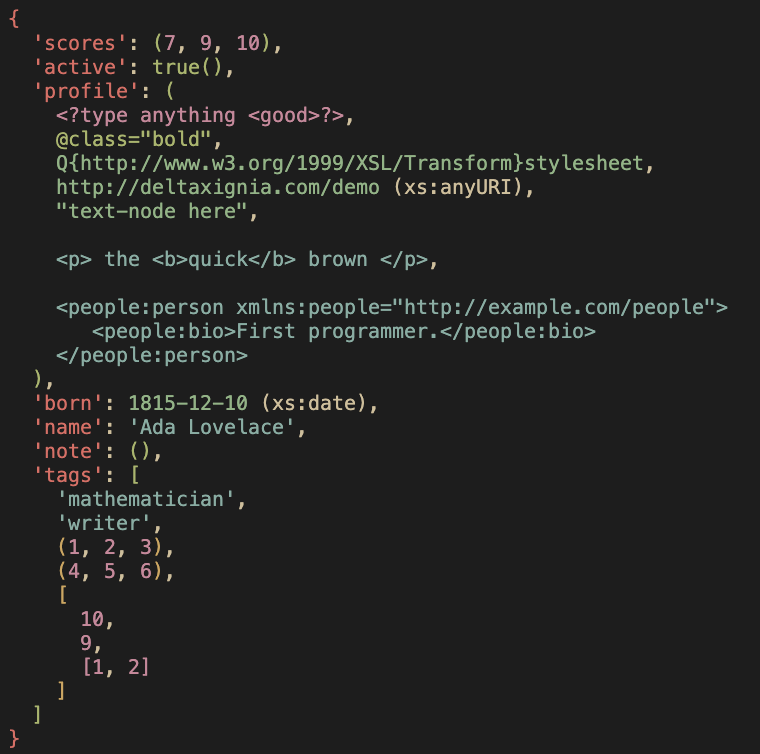

# xdm-viewer

Renders an XPath 3.1 Data Model value — nodes, maps, arrays, and atomic
values, in any combination or nesting — as legible output for a human, in
either of two forms:

- JSON-like text (`{'a': 1, 'b': (2, 3)}`), optionally ANSI-coloured
- a browsable HTML page with collapsible maps/arrays

## Background

This is the spiritual successor to [xpath-result-serializer](https://github.com/pgfearo/xpath-result-serializer),
an older debug-only pretty-printer for XPath results. Rather than
reimplementing its value-classification logic a second time, this project
builds directly on [xdm-persistence](https://github.com/pgfearo/xdm-persistence):
it walks the already-classified `xdm:` tree that `xdm-persistence`'s
`xdm:serialize()` produces (exact atomic types, map/array structure, node
kinds all already resolved) and just renders it, in two different ways.

Implemented with [Claude](https://claude.com/claude-code).

## Requires xdm-persistence as a sibling checkout

This repo depends on `xdm-persistence` via a relative `xsl:import` and does
not vendor or submodule it. Clone both under the same parent directory:

```
github/
├── xdm-persistence/
└── xdm-viewer/
```

## Files

| File | Functions / Purpose |
|---|---|
| `src/xdm-view-text.xsl` | `xdm:view-text($value, $useColor?)`<br>`xdm:persisted-to-text-view($doc, $useColor?)` |
| `src/xdm-view-html.xsl` | `xdm:view-html($value)`<br>`xdm:persisted-to-html-view($doc)`<br>`xdm:view-html-fragment($value)`<br>`xdm:persisted-to-html-fragment($doc)` |
| `src/xdm-view-common.xsl` | `xdm:path($node)`<br>plus other helpers shared by both renderers |
| `src/xdm-view.xsl` | Single entry point — imports all three of the above |

*Import `xdm-view.xsl` rather than the individual renderer files as they have shared xsl import dependencies*

## Usage

### Without an xdm value instance:

```xml
<xsl:import href="src/xdm-view.xsl"/>

<xsl:variable name="value" as="item()*" select="map { 'a': 1, 'b': (2, 3) }"/>

<xsl:sequence select="xdm:view-text($value)"/>
<!-- {'a': 1, 'b': (2, 3)} -->

<xsl:sequence select="xdm:view-text($value, true())"/>
<!-- same, with ANSI color codes -->

<xsl:sequence select="xdm:view-html($value)"/>
<!-- a full HTML document-node(), ready for xsl:result-document -->
```

### With an xdm value saved previously as xml using `xdm-persistence`'s `xdm:serialize()` function:

```xml
<xsl:sequence select="xdm:persisted-to-text-view(doc('data.xml'))"/>
<xsl:sequence select="xdm:persisted-to-text-view(doc('data.xml'), true())"/>
<xsl:sequence select="xdm:persisted-to-html-view(doc('data.xml'))"/>
```

`xdm:view-text`/`xdm:view-html` are themselves just `xdm:serialize($value)`
followed by one of these - so parsing a persisted document back into a value
with `xdm:parse()` first, then calling `xdm:view-text`/`xdm:view-html` on it,
would work but re-serializes it right back into an equivalent tree for no
reason.

Want your own page - your own `<title>`, your own CSS, or the rendered
value embedded alongside other content - rather than the fixed page
`xdm:view-html`/`xdm:persisted-to-html-view` produce? Use the `-fragment`
variants, which return just the rendered content (no `<html>`/`<head>`/
`<body>`), and build your own shell around it:

```xml
<xsl:variable name="fragment" as="element()*" select="xdm:view-html-fragment($value)"/>

<html>
  <head><title>My Own Page</title><style>/* your own CSS */</style></head>
  <body><xsl:sequence select="$fragment"/></body>
</html>
```

`xdm:stylesheet-text()` returns this project's own CSS as a string, if you
want to reuse it rather than write your own.

## XDM print debugging

`xdm:view-text` renders a single value with no formatting imposed beyond the
value itself. `xdm:debug($title, $labels)` is a different, focussed tool: a
fixed *format* for the specific habit of dumping several named variables to
one `xsl:message` call at a checkpoint in a stylesheet - not a general
substitute for `xdm:view-text`, since it always adds a title banner and
label columns that other callers may not want.

```xml
<xsl:variable name="total" as="xs:double" select="42.5"/>
<xsl:variable name="items" as="xs:integer*" select="(1, 2, 3)"/>
<xsl:variable name="node" as="element()">
  <item sku="A1"><name>Widget</name></item>
</xsl:variable>

<xsl:message select="xdm:debug('after totals loop', map {
  'total': $total, 
  'items': $items, 
  'node':  $node
})"/>
```

```
───────────────────────── after totals loop ──────────────────────────
items: (1, 2, 3)
node:  
       <item sku="A1">
          <name>Widget</name>
       </item>
total: 42.5
```

- `$labels`' keys are plain, unquoted labels rather than real map data - so the wrapper itself never reads as part of
  the value.
- All labeled values are serialized together in one call, so identity is
  preserved consistently across them exactly as it is for a single ordinary
  value: two labels pointing at the same document still show matching `#N`
  references.
- Map key order isn't guaranteed, so labels can print in a different order
  than you wrote them - above, `total`/`items`/`node` came out as
  `items`/`node`/`total`.
- `xdm:debug($title, $labels, $useColor?)` takes the same `$useColor` flag as
  `xdm:view-text`, with the same ANSI-via-`xsl:message` caveat described in
  "Color output" below.
- Text-only - there's no HTML equivalent, since it's built for the
  `xsl:message`/stdout debugging workflow specifically.
- A label written with a leading `_` (e.g. `'_total': $total`) gets a blank
  line above it and renders without the underscore - lets you group related
  labels within one call:

  ```xml
  <xsl:sequence select="xdm:debug('loop', map {
    'i': $i, 'total': $total,
    '_input': $input, 'parsed': $parsed
  })"/>
  ```

  ```
  ──────────────────────────────── loop ────────────────────────────────
  i:     3
  total: 42.5

  input:  'raw text'
  parsed: true()
  ```

  This relies on `$labels` rendering in the order it was written - not
  guaranteed by XPath 3.1 maps, but XPath/XQuery/XSLT 4.0 formally defines
  maps as an ordered sequence of entries, and Saxon 13 already preserves
  insertion order accordingly. On an older, XPath-3.1-only processor a
  group's blank line may land next to the wrong neighbor (map order there
  is implementation-defined), but nothing breaks - the marker itself is
  just string handling on the key.

### `xdm:path` - An XPath location for debugging

For debugging we often need to know the location of a node rather than it's value.
The `xdm:path` function provides a simplified node location - it uses
prefixed element names rather than the full namespaces included when using the XPath
`fn:path` function, the two outputs are compared below:

```xquery
<xsl:message select="xdm:path($node)">
/books/book[2]

<xsl:message select="path($node)">
/Q{com.examples/books}books[1]/Q{com.examples/books}book[2]
```

## Example

```sh
java -jar saxon.jar -xsl:examples/demo.xsl -it
```

Prints an ANSI-coloured text view to stdout (via primary output - see
"Color output" below for why) and writes two HTML files:
`examples/out/view-demo.html` (the collapsible `xdm:view-html` output) and
`examples/out/view--text-demo.html` (the same text view, uncoloured, in a
`<pre><code>`).

## Color output



*Color works out of the box via primary output; getting it through
`xsl:message` instead needs a custom `MessageListener` via Saxon's Java
API - see below.*

`xdm:view-text($value, true())` produces real ANSI escape codes, but
XSLT processors like Saxon cannot always process them when the result goes through `xsl:message`: Saxon's
default `MessageListener` (and most XSLT tooling built on it) XML-entity-encodes
message content, turning `ESC[0;31m` into the literal text `&#x1b;[0;31m`.
This isn't specific to any one tool - it's the default behavior of Saxon's
own message delivery.

Two ways around it:

- **Primary output** (`xsl:output method="text"`, writing to stdout or a
  file rather than `xsl:message`) is not affected - it writes the escape
  codes through untouched with plain Saxon, no extra tooling needed:

  ```xml
  <xsl:output method="text"/>

  <xsl:template name="xsl:initial-template">
    <xsl:sequence select="xdm:view-text($value, true())"/>
  </xsl:template>
  ```

  ```sh
  java -jar saxon.jar -xsl:demo.xsl -it
  ```

  No `-o:` needed - when the command line doesn't name an output file,
  Saxon's CLI writes the primary result tree straight to stdout.
- **Driving Saxon via its Java API**, install your own `MessageListener`/
  `MessageListener2` on the transformer that writes the message's string
  value out directly (e.g. `System.err.println(content.getStringValue())`)
  instead of using Saxon's default one, which is what avoids the
  entity-encoding.

## Tests

```sh
SAXON_JAR=/path/to/saxon-he-12.jar tests/run.sh
```

Since rendered output has no natural "correct answer" to `deep-equal`
against (unlike `xdm-persistence`'s round-trip tests), these check that a
representative value's rendering contains the expected fragments
(`{`, `'name'`, `true()`, ...) rather than an exact string match — map
key iteration order isn't guaranteed, so an exact expected string would be
fragile.

## Requirements

Same as `xdm-persistence`: an XSLT 3.0 / XPath 3.1 processor with maps,
arrays and higher-order functions — e.g. Saxon Home Edition or above, 9.8+.
